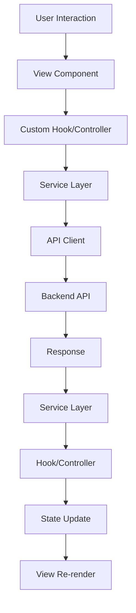
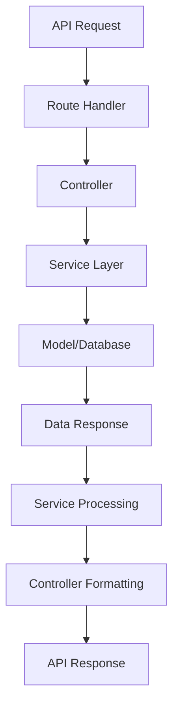

# 🏗️ Estrutura MVC - IndicaFlow Brasil

## 📋 Visão Geral da Arquitetura

O **IndicaFlow Brasil** segue o padrão **MVC (Model-View-Controller)** com separação clara de responsabilidades e modularidade para facilitar manutenção e escalabilidade.

## 🎯 Estrutura Frontend (React/TypeScript)

### **View Layer (Camada de Visualização)**

```
src/
├── components/                 # Componentes de UI
│   ├── layout/                # Layout principal
│   │   ├── Header.tsx         # 🎨 Cabeçalho global
│   │   ├── Sidebar.tsx        # 🎨 Menu lateral
│   │   └── RightDrawer.tsx    # 🎨 Painel de detalhes
│   │
│   ├── dashboard/             # Dashboard específico
│   │   ├── Dashboard.tsx      # 📊 Página principal
│   │   ├── DashboardCharts.tsx # 📈 Gráficos
│   │   ├── QuickActions.tsx   # ⚡ Ações rápidas
│   │   └── SearchBar.tsx      # 🔍 Busca global
│   │
│   ├── forms/                 # Formulários
│   │   ├── ReferralForm.tsx   # 📝 Formulário de indicação
│   │   ├── ProgramForm.tsx    # 📝 Formulário de programa
│   │   └── UserForm.tsx       # 📝 Formulário de usuário
│   │
│   ├── tables/                # Tabelas de dados
│   │   ├── ReferralsTable.tsx # 📋 Tabela de indicações
│   │   ├── ProgramsTable.tsx  # 📋 Tabela de programas
│   │   └── UsersTable.tsx     # 📋 Tabela de usuários
│   │
│   ├── modals/                # Modais e dialogs
│   │   ├── CreateReferral.tsx # 🪟 Criar indicação
│   │   ├── EditProgram.tsx    # 🪟 Editar programa
│   │   └── UserDetails.tsx    # 🪟 Detalhes do usuário
│   │
│   ├── a11y/                  # Componentes de acessibilidade
│   │   ├── VLibrasWidget.tsx  # ♿ Widget VLibras
│   │   └── AccessibilityPanel.tsx # ♿ Painel de acessibilidade
│   │
│   └── ui/                    # Componentes base (shadcn/ui)
│       ├── button.tsx         # 🔘 Botão
│       ├── input.tsx          # 📝 Campo de entrada
│       ├── table.tsx          # 📊 Tabela
│       └── ...                # Outros componentes
│
└── pages/                     # Páginas da aplicação
    ├── Index.tsx              # 🏠 Página principal
    ├── Dashboard.tsx          # 📊 Dashboard
    ├── Referrals.tsx          # 👥 Gestão de indicações
    ├── Programs.tsx           # 🎯 Gestão de programas
    ├── Users.tsx              # 👤 Gestão de usuários
    ├── Analytics.tsx          # 📈 Analytics
    └── Settings.tsx           # ⚙️ Configurações
```

### **Controller Layer (Camada de Controle)**

```
src/
├── hooks/                     # Hooks customizados (Controllers)
│   ├── api/                   # Hooks de API
│   │   ├── useReferrals.ts    # 🎣 Gerencia indicações
│   │   ├── usePrograms.ts     # 🎣 Gerencia programas
│   │   ├── useUsers.ts        # 🎣 Gerencia usuários
│   │   ├── useDashboard.ts    # 🎣 Dados do dashboard
│   │   └── useWebhooks.ts     # 🎣 Gerencia webhooks
│   │
│   ├── auth/                  # Autenticação
│   │   ├── useAuth.ts         # 🔐 Autenticação
│   │   ├── usePermissions.ts  # 🔐 Permissões
│   │   └── useSession.ts      # 🔐 Sessão
│   │
│   ├── forms/                 # Gerenciamento de formulários
│   │   ├── useReferralForm.ts # 📝 Formulário indicação
│   │   ├── useProgramForm.ts  # 📝 Formulário programa
│   │   └── useUserForm.ts     # 📝 Formulário usuário
│   │
│   ├── ui/                    # Controle de UI
│   │   ├── useTheme.ts        # 🎨 Gerencia tema
│   │   ├── useLanguage.ts     # 🌍 Gerencia idioma
│   │   ├── useNotifications.ts # 🔔 Notificações
│   │   └── useA11y.ts         # ♿ Acessibilidade
│   │
│   └── utils/                 # Utilitários
│       ├── useLocalStorage.ts # 💾 Storage local
│       ├── useDebounce.ts     # ⏱️ Debounce
│       └── useValidation.ts   # ✅ Validação
│
├── services/                  # Serviços (Business Logic)
│   ├── api/                   # Cliente da API
│   │   ├── client.ts          # 🌐 Cliente HTTP
│   │   ├── auth.ts            # 🔐 Serviços de auth
│   │   ├── referrals.ts       # 👥 Serviços de indicações
│   │   ├── programs.ts        # 🎯 Serviços de programas
│   │   ├── users.ts           # 👤 Serviços de usuários
│   │   └── webhooks.ts        # 🕸️ Serviços de webhooks
│   │
│   ├── validation/            # Validação de dados
│   │   ├── schemas.ts         # 📋 Schemas Zod
│   │   ├── referralValidation.ts # ✅ Validação indicações
│   │   ├── programValidation.ts  # ✅ Validação programas
│   │   └── userValidation.ts     # ✅ Validação usuários
│   │
│   ├── analytics/             # Analytics e métricas
│   │   ├── tracking.ts        # 📊 Rastreamento
│   │   ├── metrics.ts         # 📈 Métricas
│   │   └── reports.ts         # 📄 Relatórios
│   │
│   └── integrations/          # Integrações externas
│       ├── vlibras.ts         # ♿ VLibras
│       ├── zapier.ts          # 🔗 Zapier
│       └── slack.ts           # 💬 Slack
│
└── context/                   # Context API (Estado Global)
    ├── AuthContext.tsx        # 🔐 Contexto de autenticação
    ├── ThemeContext.tsx       # 🎨 Contexto de tema
    ├── LanguageContext.tsx    # 🌍 Contexto de idioma
    ├── A11yContext.tsx        # ♿ Contexto de acessibilidade
    └── NotificationContext.tsx # 🔔 Contexto de notificações
```

### **Model Layer (Camada de Modelo)**

```
src/
├── types/                     # Definições de tipos
│   ├── schemas.ts             # 📊 Schemas completos
│   ├── api.ts                 # 🌐 Tipos da API
│   ├── forms.ts               # 📝 Tipos de formulários
│   └── ui.ts                  # 🎨 Tipos de UI
│
├── lib/                       # Utilitários e configurações
│   ├── utils.ts               # 🛠️ Utilitários gerais
│   ├── constants.ts           # 📋 Constantes
│   ├── config.ts              # ⚙️ Configurações
│   ├── validators.ts          # ✅ Validadores
│   └── formatters.ts          # 📝 Formatadores
│
├── mock/                      # Dados simulados
│   ├── data.ts                # 📊 Dados mockados
│   ├── referrals.ts           # 👥 Indicações mock
│   ├── programs.ts            # 🎯 Programas mock
│   ├── users.ts               # 👤 Usuários mock
│   └── activities.ts          # 📋 Atividades mock
│
└── store/                     # Estado global (Zustand/Redux)
    ├── slices/                # Fatias do estado
    │   ├── authSlice.ts       # 🔐 Estado de auth
    │   ├── referralsSlice.ts  # 👥 Estado de indicações
    │   ├── programsSlice.ts   # 🎯 Estado de programas
    │   ├── usersSlice.ts      # 👤 Estado de usuários
    │   └── uiSlice.ts         # 🎨 Estado de UI
    │
    ├── middleware/            # Middleware do store
    │   ├── logger.ts          # 📝 Logger
    │   ├── persist.ts         # 💾 Persistência
    │   └── api.ts             # 🌐 Middleware de API
    │
    └── index.ts               # 🏪 Configuração do store
```

## 🗄️ Estrutura Backend (Node.js/Express)

### **Model Layer (Camada de Modelo)**

```
backend/
├── src/
│   ├── models/                # Modelos de dados
│   │   ├── User.ts            # 👤 Modelo de usuário
│   │   ├── Referral.ts        # 👥 Modelo de indicação
│   │   ├── Program.ts         # 🎯 Modelo de programa
│   │   ├── Activity.ts        # 📋 Modelo de atividade
│   │   ├── Notification.ts    # 🔔 Modelo de notificação
│   │   └── Webhook.ts         # 🕸️ Modelo de webhook
│   │
│   ├── database/              # Configuração do banco
│   │   ├── connection.ts      # 🔗 Conexão
│   │   ├── migrations/        # 📦 Migrações
│   │   ├── seeds/             # 🌱 Seeds
│   │   └── schemas/           # 📋 Schemas
│   │
│   └── types/                 # Tipos TypeScript
│       ├── models.ts          # 📊 Tipos dos modelos
│       ├── api.ts             # 🌐 Tipos da API
│       └── database.ts        # 🗄️ Tipos do banco
```

### **View Layer (Camada de Visualização)**

```
backend/
├── src/
│   ├── routes/                # Rotas da API (Controllers)
│   │   ├── auth.ts            # 🔐 Rotas de autenticação
│   │   ├── users.ts           # 👤 Rotas de usuários
│   │   ├── referrals.ts       # 👥 Rotas de indicações
│   │   ├── programs.ts        # 🎯 Rotas de programas
│   │   ├── dashboard.ts       # 📊 Rotas do dashboard
│   │   ├── webhooks.ts        # 🕸️ Rotas de webhooks
│   │   └── admin.ts           # ⚙️ Rotas administrativas
│   │
│   ├── controllers/           # Controladores
│   │   ├── AuthController.ts  # 🔐 Controlador de auth
│   │   ├── UserController.ts  # 👤 Controlador de usuários
│   │   ├── ReferralController.ts # 👥 Controlador de indicações
│   │   ├── ProgramController.ts  # 🎯 Controlador de programas
│   │   ├── DashboardController.ts # 📊 Controlador do dashboard
│   │   └── WebhookController.ts   # 🕸️ Controlador de webhooks
│   │
│   └── responses/             # Formatadores de resposta
│       ├── ApiResponse.ts     # 📤 Resposta padrão
│       ├── ErrorResponse.ts   # ❌ Resposta de erro
│       └── PaginationResponse.ts # 📄 Resposta paginada
```

### **Controller Layer (Camada de Controle)**

```
backend/
├── src/
│   ├── services/              # Lógica de negócio
│   │   ├── AuthService.ts     # 🔐 Serviço de autenticação
│   │   ├── UserService.ts     # 👤 Serviço de usuários
│   │   ├── ReferralService.ts # 👥 Serviço de indicações
│   │   ├── ProgramService.ts  # 🎯 Serviço de programas
│   │   ├── NotificationService.ts # 🔔 Serviço de notificações
│   │   ├── WebhookService.ts  # 🕸️ Serviço de webhooks
│   │   └── AnalyticsService.ts # 📊 Serviço de analytics
│   │
│   ├── middleware/            # Middlewares
│   │   ├── auth.ts            # 🔐 Autenticação
│   │   ├── validation.ts      # ✅ Validação
│   │   ├── rateLimit.ts       # 🚦 Rate limiting
│   │   ├── cors.ts            # 🌐 CORS
│   │   ├── logging.ts         # 📝 Logging
│   │   └── errorHandler.ts    # ❌ Tratamento de erros
│   │
│   ├── utils/                 # Utilitários
│   │   ├── validation.ts      # ✅ Validadores
│   │   ├── encryption.ts      # 🔒 Criptografia
│   │   ├── email.ts           # 📧 Envio de emails
│   │   ├── sms.ts             # 📱 Envio de SMS
│   │   ├── jwt.ts             # 🎫 JWT
│   │   ├── pagination.ts      # 📄 Paginação
│   │   └── formatters.ts      # 📝 Formatadores
│   │
│   └── integrations/          # Integrações externas
│       ├── payment/           # 💳 Pagamentos
│       │   ├── pix.ts         # 💳 PIX
│       │   └── stripe.ts      # 💳 Stripe
│       │
│       ├── crm/               # 🏢 CRM
│       │   ├── hubspot.ts     # 🏢 HubSpot
│       │   └── salesforce.ts  # 🏢 Salesforce
│       │
│       └── communication/     # 💬 Comunicação
│           ├── slack.ts       # 💬 Slack
│           ├── discord.ts     # 💬 Discord
│           └── telegram.ts    # 💬 Telegram
```

## 📊 Fluxo de Dados MVC

### **Frontend Flow**



### **Backend Flow**



## 🔧 Configuração de Desenvolvimento

### **Estrutura de Pastas Completa**

```
indica-flow-brasil/
├── 📁 frontend/               # Frontend React
│   ├── src/
│   │   ├── components/        # Componentes UI (View)
│   │   ├── hooks/             # Hooks customizados (Controller)
│   │   ├── services/          # Serviços e lógica (Controller)
│   │   ├── types/             # Tipos TypeScript (Model)
│   │   ├── lib/               # Utilitários (Model)
│   │   ├── mock/              # Dados mockados (Model)
│   │   ├── context/           # Context API (Model)
│   │   └── store/             # Estado global (Model)
│   │
│   ├── public/                # Arquivos públicos
│   ├── docs/                  # Documentação
│   └── tests/                 # Testes
│
├── 📁 backend/                # Backend Node.js
│   ├── src/
│   │   ├── models/            # Modelos de dados (Model)
│   │   ├── controllers/       # Controladores (Controller)
│   │   ├── services/          # Lógica de negócio (Controller)
│   │   ├── routes/            # Rotas da API (View)
│   │   ├── middleware/        # Middlewares (Controller)
│   │   ├── utils/             # Utilitários (Model)
│   │   ├── database/          # Configuração do banco (Model)
│   │   └── integrations/      # Integrações (Controller)
│   │
│   ├── docs/                  # Documentação da API
│   ├── tests/                 # Testes
│   └── migrations/            # Migrações do banco
│
├── 📁 docs/                   # Documentação geral
│   ├── PRD.md                 # Documento de requisitos
│   ├── ROADMAP.md             # Roadmap do projeto
│   ├── CONTRIBUTING.md        # Guia de contribuição
│   ├── MVC_STRUCTURE.md       # Este arquivo
│   └── API.md                 # Documentação da API
│
├── 📁 mcp/                    # Configurações de infraestrutura
│   ├── nginx/                 # Configuração Nginx
│   ├── monitoring/            # Monitoramento
│   └── scripts/               # Scripts de deploy
│
├── docker-compose.yml         # Orquestração Docker
├── README.md                  # Documentação principal
└── LICENSE                    # Licença MIT
```

## 🎯 Responsabilidades por Camada

### **Model (Modelo)**
- 📊 **Tipos TypeScript**: Definições de interfaces e tipos
- 🗄️ **Modelos de Banco**: Estrutura dos dados no banco
- 📋 **Validação**: Schemas e regras de validação
- 🛠️ **Utilitários**: Funções auxiliares e constantes
- 💾 **Estado**: Gerenciamento de estado global

### **View (Visualização)**
- 🎨 **Componentes UI**: Interface do usuário
- 📄 **Páginas**: Rotas e páginas da aplicação
- 📡 **Rotas da API**: Endpoints do backend
- 📤 **Formatação**: Formatação de respostas
- 🎯 **Apresentação**: Lógica de apresentação apenas

### **Controller (Controlador)**
- 🎣 **Hooks Customizados**: Lógica de estado e efeitos
- 🔧 **Serviços**: Lógica de negócio
- 🔗 **Integração de API**: Comunicação com backend
- ⚙️ **Middleware**: Processamento de requisições
- 🔄 **Orquestração**: Coordenação entre camadas

## 📚 Convenções e Padrões

### **Nomenclatura**
- **Componentes**: PascalCase (`ReferralForm.tsx`)
- **Hooks**: camelCase com prefixo `use` (`useReferrals.ts`)
- **Serviços**: PascalCase com sufixo `Service` (`ReferralService.ts`)
- **Tipos**: PascalCase (`ReferralData`)
- **Constantes**: SCREAMING_SNAKE_CASE (`API_BASE_URL`)

### **Estrutura de Arquivos**
- **Um componente por arquivo**
- **Exportação default para componentes principais**
- **Exportação nomeada para utilitários**
- **Index files para re-exportação**

### **Importações**
```typescript
// 1. Bibliotecas externas
import React from 'react';
import { useQuery } from '@tanstack/react-query';

// 2. Componentes internos
import { Button } from '@/components/ui/button';
import ReferralCard from '@/components/ReferralCard';

// 3. Hooks e serviços
import { useReferrals } from '@/hooks/useReferrals';
import { referralService } from '@/services/referralService';

// 4. Tipos e utilitários
import type { Referral } from '@/types/schemas';
import { formatCurrency } from '@/lib/utils';
```

## 🧪 Testes na Arquitetura MVC

### **Frontend Tests**
```
src/
├── __tests__/
│   ├── components/            # Testes de componentes (View)
│   │   ├── ReferralForm.test.tsx
│   │   └── Dashboard.test.tsx
│   │
│   ├── hooks/                 # Testes de hooks (Controller)
│   │   ├── useReferrals.test.ts
│   │   └── useAuth.test.ts
│   │
│   ├── services/              # Testes de serviços (Controller)
│   │   ├── referralService.test.ts
│   │   └── apiClient.test.ts
│   │
│   └── utils/                 # Testes de utilitários (Model)
│       ├── validation.test.ts
│       └── formatters.test.ts
```

### **Backend Tests**
```
backend/
├── tests/
│   ├── models/                # Testes de modelos (Model)
│   │   ├── User.test.ts
│   │   └── Referral.test.ts
│   │
│   ├── controllers/           # Testes de controladores (Controller)
│   │   ├── ReferralController.test.ts
│   │   └── AuthController.test.ts
│   │
│   ├── services/              # Testes de serviços (Controller)
│   │   ├── ReferralService.test.ts
│   │   └── AuthService.test.ts
│   │
│   └── routes/                # Testes de rotas (View)
│       ├── referrals.test.ts
│       └── auth.test.ts
```

---

## 🎉 Benefícios desta Arquitetura

✅ **Separação Clara**: Cada camada tem responsabilidades bem definidas  
✅ **Escalabilidade**: Fácil adicionar novas funcionalidades  
✅ **Manutenibilidade**: Código organizado e fácil de manter  
✅ **Testabilidade**: Cada camada pode ser testada independentemente  
✅ **Reutilização**: Componentes e serviços reutilizáveis  
✅ **Padrões**: Seguindo melhores práticas da comunidade  

*Esta estrutura MVC garante que o IndicaFlow Brasil seja escalável, mantível e siga as melhores práticas de desenvolvimento.*
